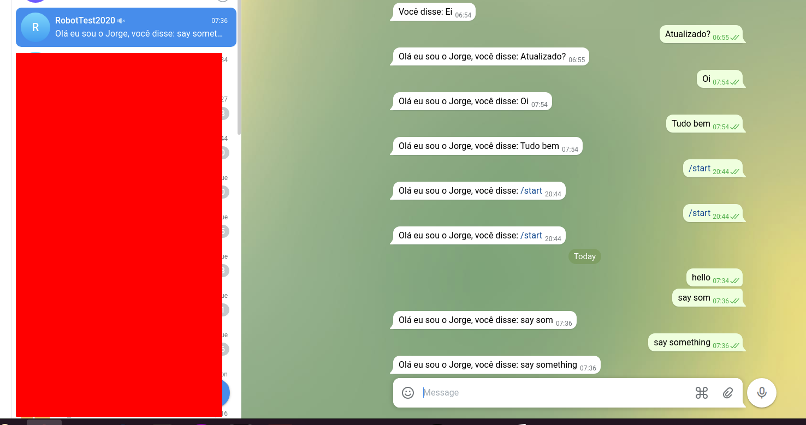

## Simple Telegram bot using python lambda function and AWS with terraform

A project to up a telegram bot using aws infrastructure and simple deploy with terraform.

#### requirements:
* terraform installed
* aws cli configured into your aws account (like `aws s3 ls` works)

#### Steps:
* replace REPLACE_ME_TOKEN_OF_BOT_FATHER on variables.tf file and put variable generate of bot father of telegram.
* run `pip install --target ./lambda_func requests`
* run `terraform init`
* run `terraform apply -auto-approve`

#### To clean up (to dont have any cost):
* run `terraform destroy`

#### final result:

#### useful commands:
`aws lambda invoke --function-name "jjfunc2"  "out.txt"`

#### resources:
* AWS API Gateway
* AWS Lambda
* Python
* Terraform

#### documentation:
* https://www.terraform.io/docs/language/providers/configuration.html
* terraform tag data: https://www.terraform.io/docs/language/data-sources/index.html and https://www.terraform.io/docs/language/expressions/references.html
* aws_iam_policy_document vs aws_iam_policy: https://registry.terraform.io/providers/hashicorp/aws/latest/docs/data-sources/iam_policy_document

